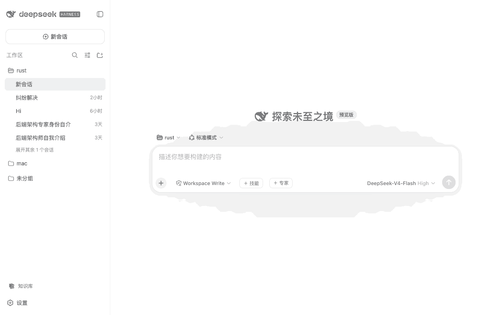
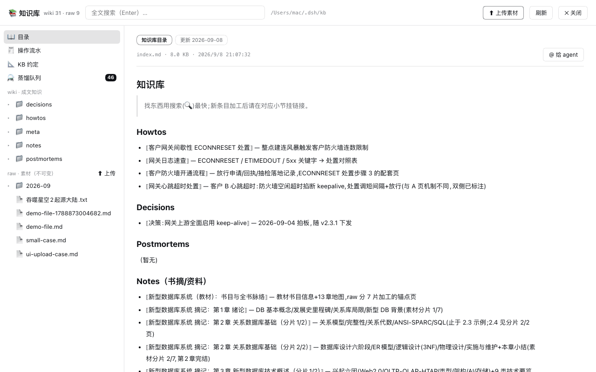

# @weibaohui/dsh-kb

[](https://github.com/topics/dsh-plugin)
[](https://www.npmjs.com/package/@weibaohui/dsh-kb)

**dsh 插件 · 团队知识库**：离线知识共享（FDE 盒子场景）。侧栏入口进全页知识库——目录树浏览、全文搜索、markdown 阅读、raw 素材上传、任意条目 `@` 给 agent。**上传即自动蒸馏**（v0.2+）：素材入队后由 kb-bot 会话按 schema 串行加工成文，也可继续手动 `@` 给 agent 精加工。

基于 Karpathy LLM Wiki 模式：raw（不可变素材）→ wiki（成文知识）→ schema（约定），人丢素材、agent 两步加工（分析 → 成文）维护 index 与 log。



**v0.2 自动蒸馏**：上传即自动入队，bot 会话按 schema 串行加工成文——「⚗️ 蒸馏队列」看进度，蒸馏模型可在设置中指定：



## 核心功能

- **全页知识库**：侧栏「📚 知识库」进入（工艺库下方）；左栏目录树（wiki / raw 懒加载），右栏阅读或搜索
- **多知识库**（v0.5.0+）：左栏顶部**下拉框切换**库（v0.6.3+ 仅显示库名），旁边「＋」弹出小框新建——素材库（建骨架、可上传、自动蒸馏）或产出库（只读浏览/搜索/@），确定后自动选中新库；选中非主库时旁边出现「✕」可移除（不删数据）；对话里「📚 知识库」按钮同样按多库列出
- **库约定可编辑**（v0.6.0+）：每个知识库各有一份 `schema.md` 加工约定，顶栏「📐 约定」或 schema.md 阅读页「✏️ 编辑约定」直接改——**每库独立，各有特色**（页面规范、目录用途、加工流程都可按库定制）；kb-bot 自动蒸馏与交互 agent 加工前都以当前库的 schema.md 为最终权威，保存即对下次加工生效，支持 ⌘S / 恢复默认模板
- **自动蒸馏**（v0.2+）：raw/ 新素材自动入队（上传钩子 + 文件监视 + 周期兜底扫描），bot 会话逐个蒸馏；右上角「⚗️ 蒸馏队列」（全局入口，v0.6.2+）看进度/重试/取消/跳转会话，支持暂停、失败退避重试、重启自动恢复、大文件按章节分批成文
- **全文搜索**：内置零依赖扫描（大小写不敏感，文本类文件，命中高亮），无需安装任何外部工具
- **问 AI**（v0.7.0+）：搜索框输入问题点「🤖 问 AI」——自动检索当前库，把命中页 @ 引用连同问题写入输入框，agent 带着依据作答并附来源
- **版本历史**（v0.7.0+）：宿主监视 wiki/ 自动快照（内容有变化才记版本，每页保留 50 份）；阅读页「🕐 历史」查看/恢复任意版本，agent 或人的改动都可回滚
- **页面反馈闭环**（v0.7.0+，v0.7.1 起自动执行）：阅读页「⚠️ 反馈」记录问题到本库 `wiki/meta/feedback.md`；默认**提交后后台 agent 自动处理**——无人值守会话核实反馈、按 schema 修正页面、把该行标 `[done]`（进度看蒸馏队列面板「⚠️ 反馈处理」区块，可跳转会话）；执行器不可用时自动降级为把指令写入输入框
- **陈旧提示**（v0.7.0+）：超过 90 天未更新的页面显示「⏳ N 天未更新」标记，救火前先核对
- **下载导出**（v0.7.0+）：任意文档可下载单页原文（markdown/文本/附件）
- **markdown 阅读**：frontmatter 徽章（标题/作者/标签/更新时间）、`[[wikilink]]`、内部链接、图片内联、代码块、表格
- **素材上传**：raw/ 区可上传（log/截图/抓包…），服务端强制只进 raw/、拒绝覆盖（raw 不可变）
- **@ 给 agent**：任意条目一键把 `@绝对路径` 注入输入框，让 agent 阅读或加工
- **骨架自举**：首次启动自动创建目录与约定文件（不覆盖已有），零配置

## 知识库布局

```
~/.dsh/kb/                # DSH_KB_ROOT 可覆盖（如 /var/lib/dsh/kb）
├── raw/                  # 原始素材，不可变（人上传，agent 只读）
├── wiki/
│   ├── howtos/           # 症状 → 原因 → 步骤 → 验证
│   ├── decisions/        # 背景 → 选项 → 结论 → 后果
│   ├── postmortems/      # 时间线 → 根因 → 改进项
│   └── notes/            # 读书摘记/成书笔记（自动蒸馏大文件落这里）
├── index.md              # 目录（agent 维护，每篇成文必须挂入）
├── log.md                # 操作流水（谁、何时、动了哪些篇）
└── schema.md             # 本库加工约定（可编辑，每库独立：页面规范 / 目录用途 / 加工流程）
```

## 安装

```bash
dsh plugin --profile web add @weibaohui/dsh-kb -w
```

装完重启 `dsh web` 即生效。

### 配套 agent 技能（必须装，否则 agent 不会加工沉淀）

把 `skill/dsh-kb/` 安装进技能市场（skills-management），agent 即获得查询/两步加工/矛盾标注/log 纪律。另见 `docs/lint-prompt.md`：在 dsh-tasks 加一条每月 lint 定时项（死链/孤儿页/陈旧条目清单）。

## 使用

1. 侧栏点「📚 知识库」；顶部搜索框全文检索（Enter），左侧树点开浏览
2. 点文件名阅读；`[[链接]]` 与内部链接可点击跳转；点「@ 给 agent」把条目丢进对话框
3. 往 raw/ 传素材：raw 树内打开任意页面，右上「上传素材」
4. 加工沉淀：`@raw/xxx.log` 给 agent，说「按 schema 加工入库」——agent 两步加工后成文、挂 index、记 log
5. 定制约定：顶栏「📐 约定」编辑当前库的 `schema.md`（每库独立，保存即生效）——比如某个库只收「解决方案」形态、某个库要求中文标题，各库各具特色

## 与 dsh-file-share 的分界

file-share 管**会话工作区**的文件（跟着会话 cwd 走）；dsh-kb 管**跨会话、跨人的固定知识库**（只读为主 + raw 上传 + 搜索）。二者互不依赖。

## 联系我 :飞书群


## 版本兼容性

本插件与 [DeepSeek Harness](https://github.com/deepseek-ai/deepseek-harness)（`@deepseek-ai/dsh`）的版本对应关系：

| 插件版本 | 适配 dsh 版本 | 备注 |
|---------|--------------|------|
| 0.7.8 | 0.1.7-rc.2 | 当前版本，已在 @deepseek-ai/dsh@0.1.7-rc.2 下验证运行 |

> **发版约定**：每次发布新版本时，请在上表追加一行，记录该插件版本实际验证所用的 `@deepseek-ai/dsh` 版本。`package.json` 的 `engines.dsh` 声明最低支持版本；本表记录实际验证版本，二者配合使用。
